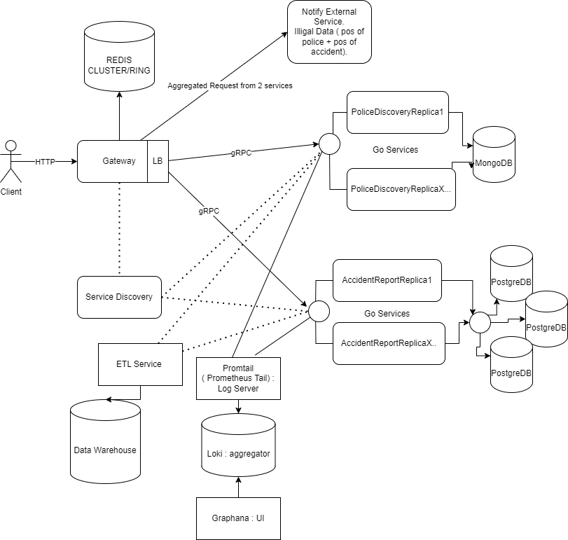

# Police and Accident Reporting Distributed  App
### _Author: Nicolae Gherman_ 
### _Group: FAF-202_  

##  Runner: 
```
docker compose up --build 
``` 
- The Gateway port exposes on 8080

## Updated Arhitecture
 

## Gateway Interface


> `POST /postPolice`
- Stores police coordonates.
* Request Body: `{ "pol_long": float, "pol_lat": float, "city":string}`
* Response Body: `{ "msg" : string }`   

> `POST /postAccident`
- Stores accident coordonates.
* Request Body: `{ "accident_long": float, "accident_lat": float, "city":string, "carsInvolved": int  }`
* Response Body: `{ "msg" : string }`

> `GET /fetchPolice`
- Based on user coordonates, it fetches the police in range of the zoom_index.  
* Request Body: `{  "user_lat": float, "user_long": float, "zoom_index": int, "city" : "string"}`
* Response Body: `{ "data": [ { "pol_long": float, "pol_lat": float, "confirmation_notification":bool, "confirmedBy": int } ]}`  


> `PUT /confirmPolice`
- Confirms the police position. If it is a false confirmation, it proceeds with a Deletion else  The Notification is set to False temporary when reaches >3 of confirmedBy Field.
* Request Body: `{ "pol_long": float, "pol_lat": float, "city":string, "confirmation":bool}`
* Response Body: `{ "msg" : string }` 


> `GET /fetchAccidents`
- Based on user coordonates, it fetches the accident in range of the zoom_index.  
* Request Body: `{  "user_lat": float, "user_long": float, "zoom_index": int, "city" : "string"}`
* Response Body: `{ "data": [ { "accident_long": float,  "accident_lat": float,  "confirmation_accident_notification":bool,  "confirmation_police_notification":bool,  "confirmedBy": int } ]}`  


> `PUT /confirmAccident`
- If the police_confirmation is True, it deletes the record. Accident Cofnirmation just increments the confirmedBy Field and sets timeout untill next switch on accident_confirmation Field on the GET logic.
* Request Body: `{ "accident_long": float, "accident_lat": float, "police_confirmation":bool, "accident_confirmation":bool, "city":string}`
* Response Body: { "msg" : string }

> `POST /informExternalService`
- It fetches the accident and police in the city. If the accident creation timestamp is bigger than 15 minutes and the police_confirmation is False, it takes the accident record and makes futher request to Police Service with accident coords.
Once the police have been detected on this range, the accident and police data is aggregated and sent further to External Service.
* Request Body: `{ "city" : string}`
* Response Body: `{ "accidents_sent" : int  }`
