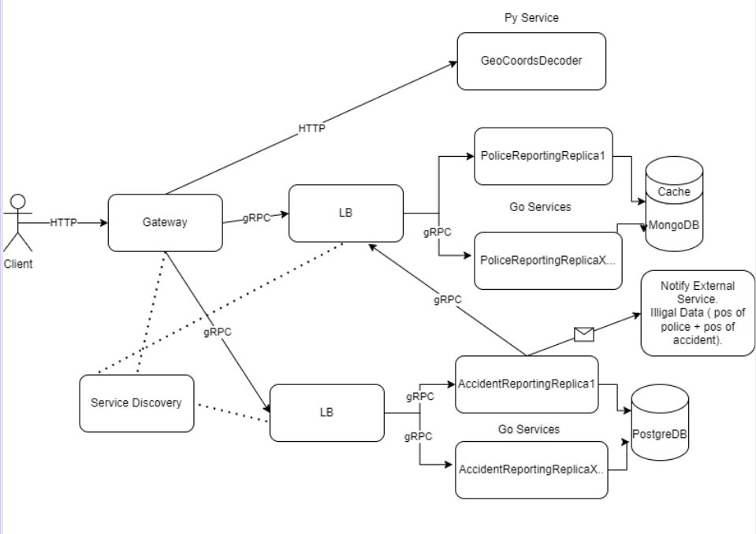

# Police and Accident Reporting Distributed  App
### _Author: Nicolae Gherman_ 
### _Group: FAF-202_  

> **Idea Summary:**  
> The users report police coordonates. On a get request (user_coords/location), the nearby police will be rendered.  Futher the next  users  would be notified on front-end and update the confirmation index (confirm that there is a policeman on thoose coordonates ) else, if that is a negative confirmation, the record  would be  deleted. After a specific time (15 mins) the confirmation process reapeats.  
>The users can report accident's coordonates. Futher the users would update the confirmation index (confirm that there is an accident on thoose coordonates) else that would be a delete.  After a specific time (10 mins), on a new get request, the user is notified with a chained questions/requests ( is there still an accident ? is there the police?). If  it is a negative confirmation of an accident or the police is there, the accident record is  deleted. If the police is not there and the accident is still confirmed, the accident reporting microservice requests info from  police reporting service and the aggregated data is sent to an external emergency service ( if any police is found in the area of the accident).  
> **DISCLAIMER:** this app/idea doesn't take in consideration ethical boundaries :-).

## Application Suitability:
- Real-Time Data Requests: Constantly rendering the map elements ( the police and accidents in this case) on it. The application has to be scalable and balanced on requests ( especially on rush hours).
- High Availability:  Ensuring that the application remains available even if individual services fail contrary to monolith arihitecture.  
- Geographic Distribution:  Databases can be scaled,  depending on geolocations, countries,cities for faster processing ( especially for Metropolitans ).
- Separated component's logic: Databases from accidents can form OLTPs that can further be aggregated as an OLAP for analyzing the frequency of accidents and making infratructural decisions on that. The police discovery microservice can be notified of nearly accidents and the  information containing the positions can be send to an external emergency service.

## Arhitecture 

## Service Boundaries

***Police Reporting Service:*** police related logic on getting the positions, confirming the positions. Further, based on user frontend questions and timestamps, it updates or deletes the positions.  

***Accident Reporting Service:*** Getting the positions, confirming the accidents. Further, based on user frontend questions and timestamps, it updates,deletes the accidents coordonates or notifies the external emergency service. It calls the police detection service and the gathered information is sent to the external emergency service. 

***Geolocation Coordonates Decoder Service:*** Given the coorodnates of the location, it sends back information such as city, street name.

##  Technology Stack and Communication Patterns 

- **Gateway, Service Discovery, GeoCoordsDecoder Service:** Python with FAST Api.  FastAPI is well-suited for building high-performance APIs, real-time applications, and microservices. Client-side RPC calls from Gateway to the following services.
- **Police  Reporting Service:** Golang with gRPC framework, MongoDB. 
- **Accident Reporting Service:** Golang with gRPC framework, PostgreDB with GORM library as ORM for database.
- **Cache:** RedisDB.

## Design Data Management

1. **Health Route For all services**  
  > `GET or rpc /health`
  * Response Body/Message: `{"ready":bool, "database": string{"connected" / "disconnected"}, "load" bool}`  

   

2. **Geolocation Coordonates Decoder Service** 

  > `POST /decode`
   * Request Body: `{ "long": float, "lat": float }`
   * Response Body: `{ "city": string, "streetName":string}` 
  
   

3. **Police Reporting Service** 
  > `rpc /fetch`  
   * Request Message: `{ "user_long": float, "user_lat": float, "zoom_index" :int, "city":string}`
   * Response Message: `{ "data": [ { "pol_long": float, "pol_lat": float, "confirmation_notification":bool, "confirmedBy": int } ]}` 
  > `rpc /postPolice` 
   * Request Message: `{ "pol_long": float, "pol_lat": float, "city":string}`
   * Response Message: `{ "error": bool, "msg" : string }`  
  > `rpc /confirm` 
   * Request Message: `{ "pol_long": float, "pol_lat": float, "city":string, "confirmation":bool}`
   * Response Message: `{ "error": bool, "msg" : string }`  

    
  

4. **Accident Reporting Service**  
  > `rpc /fetch`  
   * Request Message: `{ "user_long": float, "user_lat": float, "zoom_index" :int, }`
   * Response Message: `{ "data": [ { "accident_long": float, 
             "accident_lat": float, 
              "confirmation_accident_notification":bool, 
            "confirmation_police_notification":bool, 
               "confirmedBy": int } ]}`
  > `rpc /postAccident` 
   * Request Message: `{ "accident_long": float, "accident_lat": float, "city":string, "streetName": string, "carsInvolved": int  }`
   * Response Message: `{ "error": bool, "msg" : string }`  
  > `rpc /confirmAccident` 
   * Request Message: `{ "accident_long": float, "accident_lat": float, "confirmation":bool}`
   * Response Message: `{ "error": bool, "msg" : string }`  
  > `rpc /confirmPolice` 
   * Request Message: `{ "accident_long": float, "accident_lat": float, "confirmation":bool}`
   * Response Message: `{ "error": bool, "msg" : string }`  

    
  

## Deployment and Scaling 
* For this purpose I will use Docket Containerization. The load balancers will be implemented from scratch ( accodordingly to the type of LB from requirements)
